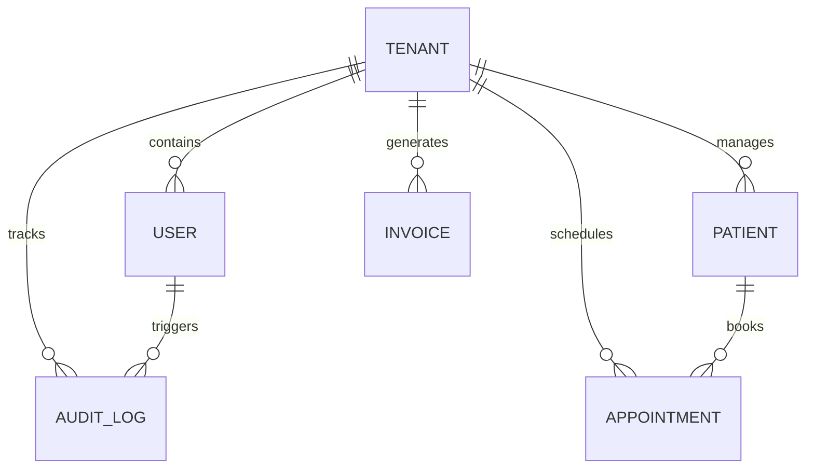

# Autonique Clinical OS — Production SaaS Architecture

This document outlines the database schema, security designs, and service patterns used to deliver a production-grade multi-tenant clinical operating system.

---

## 1. ERD (Entity Relationship Diagram)

---

## 2. Layered Architecture (Service-Repository Pattern)

To achieve clean separation of concerns, the codebase implements a decoupled backend pipeline:

1. **Vite / TanStack Start Server Functions**: Receives HTTP parameters from UI routing contexts, extracts authentication credentials, and validates inputs.
2. **Business Services Layer (`src/services/`)**: Enforces RBAC permissions, coordinates multi-tenant isolation, schedules background jobs, and emits audit logs.
3. **Database Repositories (`src/repositories/`)**: Direct SQL compiler layers executing operations scoped strictly by `tenantId`.
4. **Drizzle ORM Connection Pool**: Maintains connectivity with PostgreSQL, formats results, and executes queries.

---

## 3. Database Schema Specification

### 3.1 `tenants`
Stores isolated subscriber clinics.
* `id` (text, Primary Key)
* `name` (text, Clinic brand name)
* `plan` (text, Subscription tier: `essential` | `growth` | `enterprise`)
* `stripe_customer_id` (text, Stripe billing gateway link)
* `created_at` (timestamp)

### 3.2 `users`
Clinic staff members who can access the dashboard.
* `id` (text, Primary Key)
* `tenant_id` (text, Foreign Key referencing `tenants.id` on cascade delete)
* `name` (text)
* `email` (text, unique)
* `password_hash` (text)
* `role` (text: `owner` | `admin` | `manager` | `staff`)
* `created_at` (timestamp)

### 3.3 `patients`
Protected patient medical records.
* `id` (text, Primary Key)
* `tenant_id` (text, FK referencing `tenants.id`)
* `name` (text)
* `email` (text)
* `phone` (text)
* `city` (text)
* `status` (text: `Active` | `Inactive` | `Pending`)
* `visits` (integer)
* `balance` (integer, stored in cents)
* `provider` (text)
* `last_visit` (text)
* `next_visit` (text)
* `notes` (text)
* `created_at` (timestamp)

### 3.4 `appointments`
Calendar schedules.
* `id` (text, Primary Key)
* `tenant_id` (text, FK referencing `tenants.id`)
* `patient_id` (text, FK referencing `patients.id`)
* `practitioner_name` (text)
* `time` (text)
* `status` (text: `Confirmed` | `Pending` | `Cancelled`)
* `notes` (text)
* `created_at` (timestamp)

### 3.5 `invoices`
Billing receipts.
* `id` (text, Primary Key)
* `tenant_id` (text, FK referencing `tenants.id`)
* `patient_name` (text)
* `amount` (text)
* `date` (text)
* `duration` (text)
* `status` (text: `Paid` | `Unpaid` | `Void`)
* `created_at` (timestamp)

### 3.6 `audit_logs`
Immutable HIPAA logs tracking modifications.
* `id` (uuid, Primary Key)
* `tenant_id` (text, FK referencing `tenants.id`)
* `user_id` (text, FK referencing `users.id`)
* `action` (text, action key: e.g. `READ_PATIENT`, `CREATE_INVOICE`)
* `resource` (text)
* `details` (text)
* `created_at` (timestamp)

### 3.7 `background_jobs`
Pending asynchronous background queue items.
* `id` (uuid, Primary Key)
* `type` (text: `reminder` | `invoice_generation`)
* `status` (text: `pending` | `processing` | `completed` | `failed`)
* `payload` (text, JSON properties)
* `run_at` (timestamp)
* `error` (text)
* `created_at` (timestamp)

---

## 4. Security & Role-Based Access Control (RBAC)

Every administrative action is subject to role validation rules:

| Permission | Description | Owner | Admin | Manager | Staff |
| :--- | :--- | :---: | :---: | :---: | :---: |
| `patient:read` | View patient files, notes, and vitals | ✅ | ✅ | ✅ | ✅ |
| `patient:write` | Modify clinical records and profiles | ✅ | ✅ | ✅ | ❌ |
| `patient:delete` | Erase records | ✅ | ❌ | ❌ | ❌ |
| `billing:read` | View payouts and invoices | ✅ | ✅ | ✅ | ❌ |
| `billing:write` | Modify status, charge cards, refund | ✅ | ✅ | ❌ | ❌ |
| `settings:read` | View settings panels | ✅ | ✅ | ✅ | ✅ |
| `settings:write` | Modify clinical roster/subscription | ✅ | ✅ | ❌ | ❌ |
| `audit:read` | View HIPAA system audit logs | ✅ | ✅ | ❌ | ❌ |

---

## 5. Background Worker Operations

The asynchronous runner (`src/services/worker.ts`) operates a polling loop checking the `background_jobs` table:

1. **Retrieval**: Polls jobs where `status = 'pending'` and `run_at <= NOW()`.
2. **Locking**: Changes status to `processing`.
3. **Execution**: Parses payload properties and runs respective functions.
4. **Resolution**: Marks `completed` or records exceptions in `failed`.
